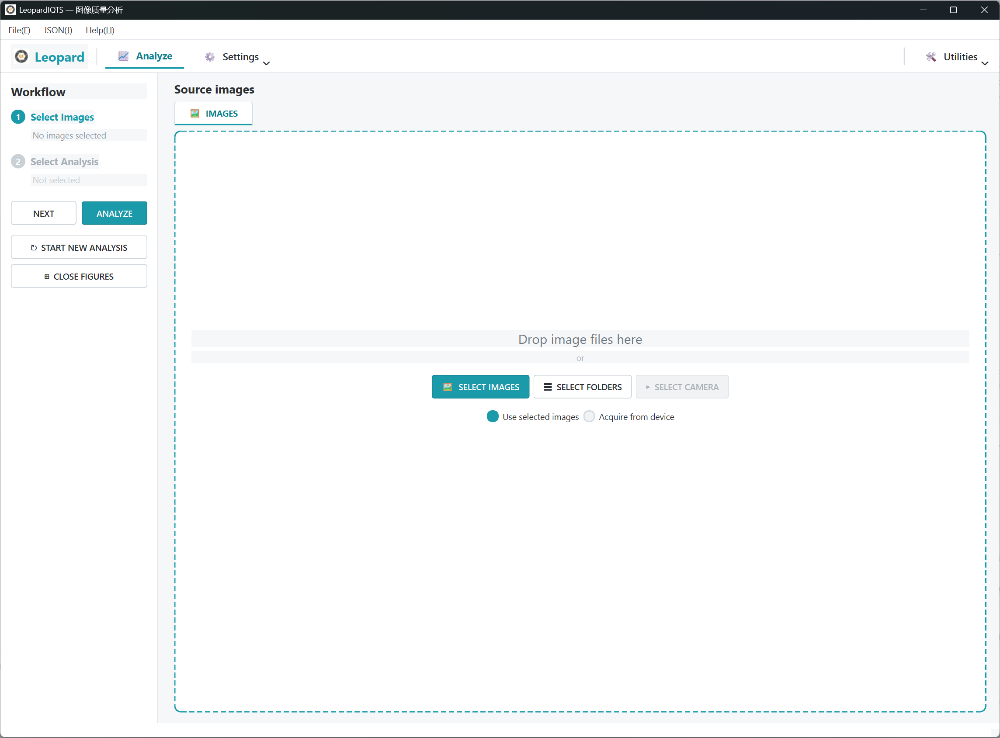

# LeopardIQTS 软件使用说明书

> **版本**：v0.1.1
> **适用软件**：LeopardIQTS — 图像质量分析软件  
> **更新日期**：2026-08-25  
> **目标环境**：Windows + conda 环境 `LpIQtest312`（Python 3.12）

**Revision History**


| Version | Date        | Description           |
| ------- | ----------- | --------------------- |
| 0.1.0   | 25 08, 2006 | 初始版本                  |
| 0.1.1   | 25 08, 2026 | 更新 MTF/SFR ROI 框选斜边介绍 |


---

## 目录

1. [软件概述](#一软件概述)
2. [主界面介绍](#二主界面介绍)
3. [通用操作流程](#三通用操作流程)
4. [MTF/SFR 测试](#四mtfsfr-测试)
5. [RAW 图像读取配置](#五raw-图像读取配置)
6. [MTF 结果导出与模组比较](#六mtf-结果导出与模组比较)
7. [菜单功能](#七菜单功能)

---

## 一、软件概述

**LeopardIQTS** 是 Leopard Imaging 开发的镜头图像质量（Image Quality, IQ）评估桌面软件，基于 `LeopardIQ` 算法库，面向镜头评估工程师提供图形化测试环境。

### 1.1 功能范围

MTF/SFR 模块及其配套功能。

| 模块                       | 功能说明                                                            | 状态    |
| ------------------------ | --------------------------------------------------------------- | ----- |
| **MTF / SFR**            | 斜边空间频率响应分析：ROI 框选、MTF 曲线、MTF50 / MTFnn / MTFnnP 指标、PASS/FAIL 判定 | ✅ 已实现 |
| **MTF 模组比较**             | 2~6 款镜头 MTF 结果 CSV 的 A/B 定量比较                                   | ✅ 已实现 |
| **Generalized Read Raw** | 二进制 RAW 文件全局读取参数配置                                              | ✅ 已实现 |

### 1.2 支持的图像格式

| 格式 | 说明 |
|------|------|
| `.png` / `.jpg` / `.jpeg` / `.bmp` / `.tif` / `.tiff` / `.webp` | 常见图像格式，OpenCV 直接解码 |
| `.raw` | 二进制 RAW 数据，需在 **Generalized Read Raw** 中配置分辨率/位深/CFA 等参数 |
| `.dng` | 已登记扩展名，当前按 RAW 处理 |

---

## 二、主界面介绍

启动后进入主窗口，整体布局分为四个区域：



### 2.1 功能栏

- **📈 Analyze**：主工作流标签
- **⚙ Settings**：设置下拉菜单 - 后续迭代预留
- **🛠 Utilities**：实用工具下拉菜单
	- **Generalized Read Raw…**：RAW 读取全局参数设置
	- **MTF 模组比较…**：多模组 MTF 结果 A/B 比较

### 2.2 Workflow 步骤栏（左侧）

显示当前分析进度与状态：

- **① Select Images**：显示已加载图像数量（如 "5 image(s) selected"）
- **② Select Analysis**：显示已选测试项名称
- **NEXT / PREVIOUS**：在步骤 ① 和 ② 之间切换
- **ANALYZE**：执行所选分析（需先完成 ①②）
- **↻ START NEW ANALYSIS**：清空当前会话，开始新一轮测试
- **⊞ CLOSE FIGURES**：一键关闭全部结果 Figure 窗口

### 2.3 右侧工作区

- **Source images**（步骤 ①）：图像加载与缩略图展示
- **Analysis options**（步骤 ②）：测试项单选 + 参数配置面板

---

## 三、通用操作流程

所有测试项遵循统一的向导式工作流：

```
加载图像 → 选择分析项 + 配置参数 → ANALYZE → 查看结果
```

### 3.1 步骤 ①：Select Images（加载图像）

**三种加载方式**：

1. **拖拽加载**：将图像文件或文件夹拖拽到右侧虚线区域
2. **SELECT IMAGES**：点击按钮，通过文件对话框选择单个或多个图像文件
3. **SELECT FOLDERS**：点击按钮，选择文件夹，软件自动扫描其中所有支持的图像文件（含子目录）

**管理已加载图像**：

- 已加载图像以缩略图卡片网格形式展示
- **右键点击缩略图卡片** → 选择「移除该图像」可删除单张图像
- 底部 `Use selected images` 为当前默认模式；`Acquire from device`（相机采集）为后续迭代功能

> 注意：一批图像仅对应一个测试项（各测试项拍摄环境 / 靶标不同），因此步骤 ② 中为单选。

### 3.2 步骤 ②：Select Analysis（选择分析项）

1. 点击左侧 **NEXT**（或点击步骤 ② 标题），右侧切换到 **Analysis options** 页
2. 在左侧模块列表中**勾选**需要的测试项（单选行为，勾一项自动取消其他项）
3. 右侧显示对应模块的配置面板，设置 **参数（Params）** 和 **判定标准（Criteria）**
4. 左侧步骤栏实时显示当前所选测试项名称

### 3.3 ANALYZE（执行分析）

1. 确认已加载图像且已选择分析项后，点击 **ANALYZE**
2. 分析完成后自动弹出结果 Figure 窗口

### 3.4 结果 Figure 窗口

- 分析完成后弹出独立的 Figure 窗口展示结果
- 可同时打开多个 Figure 窗口并排对比
- 点击 **⊞ CLOSE FIGURES** 一键关闭全部结果窗口
- 点击 **↻ START NEW ANALYSIS** 清空会话并关闭全部 Figure，开始新一轮测试

---

## 四、MTF/SFR 测试

MTF/SFR（调制传递函数 / 空间频率响应）是评估镜头解析力的核心指标。本软件采用参考 **ISO 12233 标准**所描述的 SFR 算法过程制作的 `sfrmat5` 计算。

### 4.1 测试原理

- 在测试图像中框选包含 **黑白斜边** 的 ROI 区域
- 算法提取斜边边缘扩散函数（ESF），经傅里叶变换得到 MTF 曲线
- 关键指标：MTF50、MTF@评估频率、MTFnn/MTFnnP（Secondary Readout）
- 结果与 criteria 阈值比对，自动判定 PASS/FAIL

### 4.2 完整操作流程

#### 步骤 0（仅 RAW 图像）：配置 Generalized Read Raw

详见 第五章 RAW 图像读取配置。

#### 步骤 1：加载图像

按 **3.1** 节加载待测试的图像文件。

#### 步骤 2：选择 MTF/SFR 分析项

1. 点击 **NEXT** 进入 Analysis options
2. 勾选 **MTF / SFR**

#### 步骤 3：载入图像到 MTF 面板

1. 在 MTF 面板的「ROI 框选（斜边）」区，从 **「源图像」** 下拉框中选择一张图像
2. 点击 **「载入图像」** 按钮
3. 图像显示在主视图中，像高（picture_height）自动填入图像高度

#### 步骤 4：ROI 框选斜边

ROI（Region of Interest）是 MTF 计算的基本单元，每个 ROI 须包含一条清晰的黑白斜边。

**主视图工具行**：`[查看]` `[框选…]` `[适应窗口]` `[清空 ROI]`

- **「查看」与「框选…」为互斥单选按钮**，激活项以颜色高亮
- 主视图固定为「查看」模式，**不可直接画框**，避免误触

**添加 ROI 的两种方式**：

**方式 A：弹窗框选 + 精调**

1. 点击 **「框选…」** 按钮，弹出「ROI 框选/精调」窗口
2. 窗口初始显示全图，光标变为十字，提示「在图像上按住左键拖拽，框选包含一条黑白斜边的 ROI」
3. **拖拽画出虚线粗框**
4. 画出后自动放大进入精调状态
5. 精调操作：
   - **整体移动**：↑↓←→ 方向键按钮
   - **边缘调整**：通过步长移动ROI的边缘 ( L左, R右, T上, B下 ) 
   - **步长**：1 / 5 / 15 px 单选 ( 默认 1px )，边缘调整的步长
   - **精确坐标**：L/R/T/B 数值框直接输入像素坐标 (回车生效)
   - **视图切换**：「显示全图」/「适应 ROI」
   - **框选新 ROI**：选取新的ROI
   - **多 ROI 切换**：「上一个 ROI」/「下一个 ROI」
6. 确认无误后点击 **「确定」**，ROI 写回主视图

**方式B：Add LF CSV**，支持读取 LenFocus CSV 坐标结果

1. 设定 LF 边长，通过 LenFocus 保存的 config.json 文件参数 "MIN_LINES" 确定 ( "MIN_LINES"=20, LF 边长设置为40 )
2. Add LF CSV...，选取需要的CSV，软件会自动将对应ROI框选在画面中

**查看模式下管理已有 ROI**

- **单击 ROI**：选中（橙色高亮）
- **双击 ROI**：重新弹出精调窗口
- **右键 ROI** 或 **按 Delete 键**：删除单个 ROI
- **「清空 ROI」**：删除全部 ROI
- **滚轮**：缩放视图
- **拖拽**：平移视图

#### 步骤 5：设置参数与判定 Criteria

**Parameters（参数）**：

| 参数                         | 说明                                                          |
| -------------------------- | ----------------------------------------------------------- |
| **像元尺寸 (µm/px)**           | 像元物理尺寸，Cycles/mm、LP/mm、L/mm 单位换算所需                          |
| **像高 Picture Height (px)** | 图像高度，LP/PH、LW/PH 单位换算所需；载入图像后自动填入                           |
| **频率单位**                   | Cycles/pixel（默认）、Cycles/mm、LP/mm、L/mm、LP/PH、LW/PH；切换时数值自动换算 |
| **评估频率 MTF @**             | 读取该频率处的 SFR 值，参与判定（默认 0.125 cy/px = Nyquist/4）              |
| **Secondary Readout 1/2**  | MTFnn / MTFnnP 类型 + 百分比 nn（默认 MTF30、MTF30P）                 |
| **Gamma (input)**          | 编码 Gamma 倒数线性化：RAW 线性数据 = 1.0（默认）；BMP/JPEG 等 sRGB 编码 = 0.5  |

**Criteria（判定标准）**：

| 判据                  | 说明                                           |
| ------------------- | -------------------------------------------- |
| **Readout1 下限**     | Secondary Readout 1（默认 MTF30）的频率下限，按所选频率单位输入 |
| **MTF@评估频率 SFR 下限** | 评估频率处 SFR 值的下限（0~1，无单位）                      |

> 判定规则：逐 ROI 全部判据取与（任一判据 FAIL 则该 ROI 为 FAIL），总判定 = 全部 ROI 有效且无 FAIL。

#### 步骤 6：ANALYZE

点击左侧 **ANALYZE**，后台运行 MTF 计算。计算完成后自动弹出结果 Figure。

#### 步骤 7：查看 MTF 结果 Figure

结果窗口包含三部分：

**顶部判定横幅**

- **PASS**（绿色背景）或 **FAIL**（红色背景）
- 显示评估频率与 criteria 摘要

**左侧 MTF 曲线图**

- 逐 (ROI, 通道) 的 MTF 曲线（ROI 轮换配色，通道轮换线型）
- Nyquist（0.5）与评估频率参考虚线
- 支持交互：
  - **点击曲线**：选中该 ROI（曲线加粗，其余淡化）
  - **点击空白处**：取消选中
  - **滚轮**：缩放
  - **拖拽**：平移

**右侧指标表**

- ROI / 通道 / MTF @ 评估频率 / MTF50 / 各 Secondary Readout / 判定
- 点击表格行可联动选中对应 ROI 的曲线

**工具行按钮**：

- **MTF50 / MTF30**：开关标注落点（垂线连 x 轴 + 水平线连 y 轴；选中 ROI 时仅标该 ROI）
- **复位视图**：还原曲线图初始坐标范围
- **导出结果 CSV…**：导出模组比较用的 MTF 结果 CSV（见第六章）

---

## 五、RAW 图像读取配置

### 5.1 何时需要配置

仅当测试图像为 **`.raw` 二进制文件**时需要。常见格式（png/jpg/bmp/tif）由 OpenCV 直接解码，无需配置。

### 5.2 打开方式

品牌栏 **🛠 Utilities → Generalized Read Raw…**

### 5.3 参数说明

| 参数              | 说明                                                          |
| --------------- | ----------------------------------------------------------- |
| **宽度 / 高度**     | RAW 图像分辨率；填 `0` 时按文件大小自动识别常见 sensor 分辨率（含 1920×1200 等 20 种） |
| **位深**          | 10 / 12 / 14 / 16                                           |
| **CFA pattern** | Y（单通道 Mono）、RGGB、BGGR、GRBG、GBRG                             |
| **去马赛克**        | Bayer RAW 时建议勾选，输出彩色图后转灰度                                   |
| **灰度转换方法**      | BT.709 等                                                    |

### 5.4 验证配置

点击 **「读取测试…」** 选择一个 `.raw` 文件：

- 若 CFA 为 Bayer：显示彩色去马赛克预览图，可直观核对 CFA pattern 是否正确
- 若 CFA 为 Y：显示灰度预览图
- 信息行显示识别的分辨率与 min/max 像素值

### 5.5 保存与导入

- **保存**：点击「保存」按钮，设置持久化到项目目录 `assets/config/read_raw_settings.json`，对所有分析模块全局生效
- **恢复默认**：点击「恢复默认」按钮重置参数
- **Add LF Config…**：读取 LenFocus 调焦软件的 `config.json`，自动导入其 Camera 段参数（分辨率/位深/Bayer）

---

## 六、MTF 结果导出与模组比较

### 6.1 MTF 结果 CSV 导出

在 MTF 结果 Figure 窗口中，点击工具行 **「导出结果 CSV…」**：

1. 输入 **模组标签（label）**：建议填写镜头型号或序列号（如 `LensA_SN001`），该标签将用于模组比较的图例与表头
2. 选择保存路径（默认文件名：`{label}_mtf.csv`）
3. 导出完成

**CSV 格式说明**：

- 文件以 utf-8-sig（带 BOM）编码，Excel 直接打开中文不乱码
- 头部含 `#` 元数据：schema 版本、label、创建时间、图像信息、频率单位、评估频率、Gamma、像元尺寸、像高
- 数据区：逐 (ROI, 通道) 的指标（`mtf@评估频率`、`mtf50`、各 Readout、`mtfa`）
- `cx_norm` / `cy_norm`：ROI 中心归一化坐标（0~1），是模组比较时按视场位置匹配的依据

> 建议每次 MTF 测试后都导出 CSV，以备后续模组比较使用。

### 6.2 MTF 模组比较

用于**比较两款及以上（2~6 款）镜头/模组**的 MTF 结果，输出定量结论：谁更好、好多少、好在哪里。

**前置条件**：各模组已分别完成 MTF 测试并导出 CSV。

**操作步骤**：

1. **打开比较对话框**：品牌栏 **🛠 Utilities → MTF 模组比较…**（非模态对话框）
2. **载入 CSV**：
   - 对话框初始有 2 个槽位（模组 A / B）
   - 每个槽位点击 **「浏览…」** 选择该模组的 MTF 结果 CSV
   - 比较 3 款以上时点击 **「＋ 添加模组 CSV 槽位」**（最多 6 款）；点击 **「✕」** 移除槽位（至少保留 2 款）
3. **选择基准（金样）**：单选某槽位为基准（默认模组 A），其余各款均与基准比较
4. **核对口径与配对**：
   - 状态行绿色显示「口径一致…」表示可比较；红色则按提示排查（常见原因：频率单位/评估频率/Gamma 不一致）
   - ROI 配对预览表显示各款在 3×3 视场位置的 ROI 数量与公共配对数
5. **选择比较测试项**：
   - 勾选参与比较的指标（默认全选）
   - 单选「主判定」项（默认第一项），决定总体结论按哪个指标给出
6. **（可选）调整阈值与权重**：
   - **频率类打平阈值**（默认 0.01 cy/px）：差值 ≤ 阈值记为平手
   - **SFR 类打平阈值**（默认 0.01）：同上，用于 MTF@freq / MTFa
   - **评分权重**：中心 / 边缘 / 四角分区权重（默认 0.6 / 0 / 0.3）
7. **执行比较**：点击 **「执 行 比 较」**

**结果解读**：

- **左图（各款对比）**：横轴 = ROI 视场位置，纵轴 = 所选测试项值；N 条折线，基准加粗实线
- **右图（Δ 差异条形）**：各位置「各款 − 基准」并排条形；±打平阈值虚线之间的差异视为噪声
- **比较结论区**：逐款输出 vs 基准的总体结论与逐项结论

**保存比较结果**：

- 点击底部 **「保存比较结果 CSV…」**
- 两款：保存单个 CSV
- 多款：选择目录，按「基准 vs 各款」逐款落盘多个 CSV

> 注意：重新载入 CSV 或切换基准后，旧比较结果失效，需重新执行比较。

## 七、菜单功能

### 7.1 File 菜单

| 菜单项 | 状态 | 说明 |
|--------|------|------|
| 打开会话… | （后续迭代） | 加载保存的分析会话 |
| 保存会话… | （后续迭代） | 保存当前分析会话 |
| 导出报告 PDF… | （后续迭代） | 导出 PDF 测试报告 |
| 导出结果 CSV… | （后续迭代） | 导出全部结果 CSV |
| 退出 | ✅ | 关闭软件 |

### 7.2 JSON 菜单

用于保存和加载各模块的参数与判定 criteria 配置。

| 菜单项 | 说明 |
|--------|------|
| **读取 criteria 配置 (JSON)…** | 从 JSON 文件加载模块参数 + criteria + ROI 列表；ROI 在载入同名图像后自动回填 |
| **保存 criteria 配置 (JSON)…** | 将当前已选模块的参数、criteria、ROI 列表保存为 JSON |
| **恢复默认 criteria** | 将当前已选模块的 criteria 恢复为默认值 |

**JSON 配置用途**：
- 同一镜头型号的批量测试：保存一套配置，每次加载即可复用
- 不同测试场景的切换：如「D65 严判标准」vs「A 光源宽松标准」
- 团队协作：共享 JSON 文件确保测试口径一致

### 7.3 Help 菜单

| 菜单项 | 说明 |
|--------|------|
| 关于 LeopardIQTS | 显示软件版本与功能说明 |
| 用户手册 | （后续迭代） |

---

*本说明书对应 LeopardIQTS v0.1.1。后续版本功能扩展后将同步更新。*
